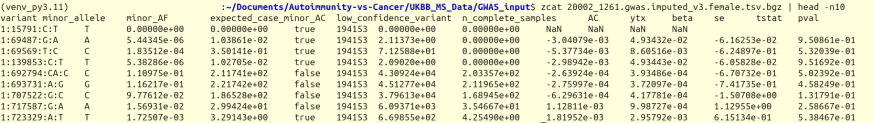
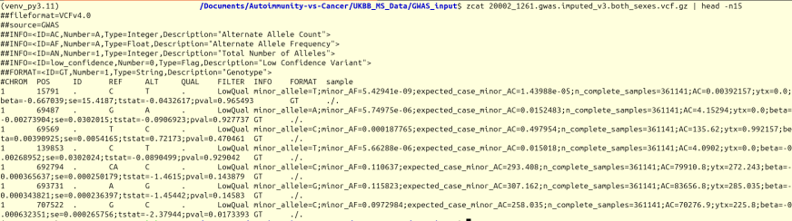

# gwas2vcf
A tool to convert GWAS TSV files to VCF format

The tool **gwas2vcf** can convert GWAS results files, like the .tsv.bgz files from UK Biobank studies, into the standard VCF 4.0 format.

For best results, it's recommended to create a virtual environment with Python 3.11.6, as that's the version this tool was tested with.

**Example of conversion**
<br>Uk BioBank GWAS Result file</br>


<br>Converted VCF4.0 file</br>



**Installation:**
```$ pip install gwas2vcf```

**Usage:** ```$ gwas2vcf [-h] -i INPUT -o OUTPUT```

```options:
  -h, --help  show this help message and exit
  -i INPUT, --input INPUT
              please provide the path for the input file with the extension *tsv.bgz
  -o OUTPUT, --output OUTPUT
              please provide desire output file name, tool will automatically append the *vcf.gz extension


